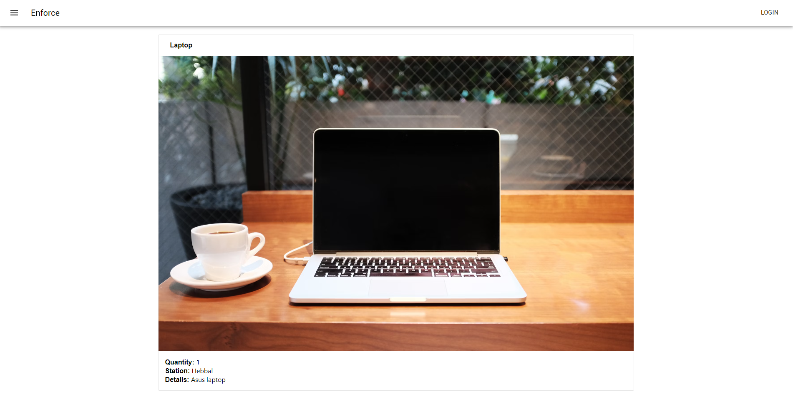
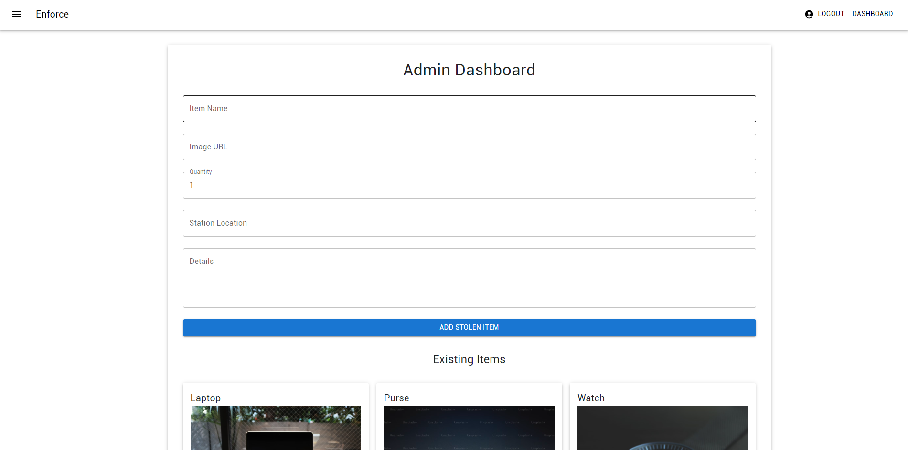

# Stolen Items Management Web App

A full-stack web application for managing and tracking stolen items. It includes an admin dashboard for adding, editing, and deleting stolen items and a user-facing home page for viewing and searching for items.

---

## Features

### Admin Features:
- **Add Items**: Enter item details, including name, image URL, quantity, station location, and additional details.
- **Edit Items**: Modify existing records in the database.
- **Delete Items**: Remove records permanently.
- **View Items**: Browse the list of all recorded stolen items.

### User Features:
- **View Items**: Browse the list of stolen items on the home page.
- **Indian Law Query**: Solves doubts based on Indian Law.

---

## Tech Stack

### Frontend:
- **React.js**: For creating an interactive user interface.
- **Material-UI (MUI)**: For consistent and modern UI components.

### Backend:
- **Node.js** with **Express**: To build RESTful APIs.
- **MongoDB**: As the database to store item details.
- **GEMINI**: To give answers to various Indian Law based doubts.

---

## Getting Started

### Prerequisites
- **Node.js** (v14+)
- **MongoDB** (Atlas or local installation)

---

### Installation

#### Clone the Repository
```bash
git https://github.com/Zneuromancer3/enforce.law.git
cd enforce.law
```

#### Install Dependencies
```bash
npm config set legacy-peer-deps true
npm install
```
legacy-peer-deps is set to true due to using an older version of  material-ui library

#### Environment Variables
Create a `.env` file in the root directory and configure the following:
```env
PORT=5000
MONGO_URI=mongodb+srv://<username>:<password>@cluster.mongodb.net/<dbname>?retryWrites=true&w=majority
```

#### Start the Backend Server
```bash
node index.js
```

---

### Frontend Setup

Navigate to the `src` directory to install and run the React app:
```bash
cd src
npm install
npm start
```

The app will run on `http://localhost:3000`.

---

## API Endpoints

Base URL: `http://localhost:5000/api`

| Method | Endpoint                    | Description                       |
|--------|-----------------------------|-----------------------------------|
| GET    | `/stolen-items`             | Fetch all stolen items           |
| POST   | `/stolen-items`             | Add a new stolen item            |
| PUT    | `/stolen-items/:id`         | Update an existing stolen item   |
| DELETE | `/stolen-items/:id`         | Delete a stolen item             |

---

## Folder Structure

```
frontend/
├── src/
│   ├── components/
│   │   ├── header.js          # Reusable header with navigation and search bar
│   │   ├── login.js           # Login page for admin authentication
│   │   ├── dashboard.js       # Admin dashboard for managing items
│   │   ├── homepage.js        # Home page displaying items and search functionality
│   │   ├── lawquery.js        # Query section for legal questions (optional)
│   └── App.js                 # Main application file
├── public/
│   └── index.html             # Root HTML file
├── package.json               # Project dependencies
├── README.md                  # Documentation
└── .env                       # Environment variables
```

---

## Screenshots

### Home Page


### Admin Dashboard


---

## License

This project is licensed under the MIT License. See the `LICENSE` file for details.

---

## Contact

For feedback or inquiries:
- **Email**: [vinuacharya2205@gmail.com](mailto:vinuacharya2205@gmail.com@)
- **GitHub**: [@Zneuromancer3](https://github.com/Zneuromancer3)
